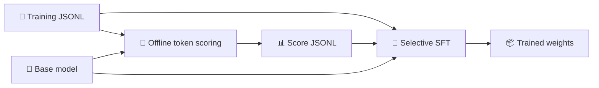

<div align="center">

# 🎯 Token Selection

**Score every response token and focus supervised fine-tuning on the selected ones.**


Offline scoring · Token masks · Selective SFT

</div>

---

## ✨ Overview

The workflow has two stages. First, a base model assigns a score to each response token in the training data. Selective SFT then uses those scores to decide which tokens contribute to the loss. Masked tokens remain in `input_ids` and continue to provide context; only their labels are set to `-100`.



| Component | What it supports |
| --- | --- |
| 🔬 **Value-gate scoring** | Per-token gradient scores from one backward pass, or per-token finite-difference ablation |
| 📈 **Token NLL** | Teacher-forced negative log-likelihood and masks matched to a reference cache's per-sample mask count |
| 🎯 **Selective SFT** | Lowest-score fraction, non-positive scores, `<think>`-only selection, and count-matched random masks |
| 🏋️ **Baseline SFT** | Standard training configurations for comparisons with the same models and datasets |

> [!NOTE]
> This repository covers token selection and training. Model weights, datasets, score caches, evaluation code, and experiment results are not included.

## 🚀 Quick start

### 1. Prepare the environment

Linux, CUDA, and Python 3.11 are recommended. Use compatible versions of PyTorch, Transformers, Datasets, OmegaConf, and LLaMAFactory. [`requirements-env-reference.txt`](requirements-env-reference.txt) records versions from the original training environment; it is a reference snapshot, not a portable lock file.

The included YAML configurations assume this directory layout:

```text
workspace/
├── token-selection-github/      ← This repository; run commands here
│   ├── configs/
│   ├── data/                   ← Datasets and generated score JSONL
│   └── outputs/                ← Training outputs
├── model/                      ← Base models
└── Qwen/LLaMA-Factory/         ← LLaMAFactory source and DeepSpeed config
```

For another layout, set `LLAMAFACTORY_SRC=/path/to/LLaMA-Factory/src` and update the model, DeepSpeed, dataset, and score paths in the selected YAML file. Set `TOKEN_SELECTION_PYTHON` to the Python executable in your environment; both entry points use it.

### 2. Score the tokens

Run this one-GPU Value-gate gradient example from the repository root. The model, template, and input data must match the intended training run:

```bash
TOKEN_SELECTION_PYTHON=/path/to/python \
bash scripts/score.sh value-gradient \
  --input data/datasets/train.jsonl \
  --model-dir ../model/Qwen3-4B-Base \
  --output data/scores/train.jsonl \
  --template qwen3 \
  --data-parallel-size 1
```

Replace `value-gradient` with `value-ablation` or `nll` for the other scoring methods. Gradient scoring preserves signed values by default; add `--score-transform positive` only when reproducing legacy non-negative scores. To use more GPUs, increase `--data-parallel-size`. Each GPU loads a full model copy.

### 3. Train with selected tokens

Check `configs/dataset_info.json` and the selected YAML's `model_name_or_path`, `deepspeed`, `dataset`, `score_file`, and `output_dir` against your local files. Then run:

```bash
TOKEN_SELECTION_PYTHON=/path/to/python \
LLAMAFACTORY_SRC=/path/to/LLaMA-Factory/src \
NPROC_PER_NODE=8 \
bash scripts/train.sh selective \
  configs/selective/selective-qwen4b-base-openmath-zero-full.yaml
```

Other training modes:

```bash
# Standard SFT
bash scripts/train.sh baseline configs/baseline/qwen4b-base-openmath-cot-100k-full.yaml

# Select tokens inside <think>; this mode also supports response-wide random masks
bash scripts/train.sh think configs/selective/selective-qwen-base-openmath-cot-100k-think-zero-full.yaml
```

Append `key=value` overrides after the configuration path, for example `output_dir=outputs/try-1`. The scripts change to the repository root, so relative paths in the YAML files are resolved from there.

## 🧭 Repository layout

```text
token_selection/
├── scoring/       Value-gate scoring, template encoding, GPU shards, resumption
├── entropy/       Token NLL scoring and count-matched mask generation
└── training/      Selective SFT, think selection, data/score alignment
configs/
├── baseline/      Standard SFT experiment configurations
├── selective/     Selective SFT experiment configurations
└── dataset_info.json
scripts/             Unified scoring and training entry points
tests/               Unit tests for scoring, masks, and training
```

## 🧩 Score-to-training alignment

Scores are stored as JSONL. Each `sample_id` is the **zero-based line number** of the source training JSONL. `token_scores` covers response content tokens only; it excludes template-added EOS/EOT markers. Training re-encodes each sample with its own tokenizer and LLaMAFactory template, then checks the sequence length, response token count, and score array length.

```json
{
  "sample_id": "42",
  "sequence_token_count": 100,
  "response_token_count": 40,
  "baseline_response_target_nll_sum": 12.3,
  "token_scores": [0.0, 0.2]
}
```

`ignore_rate` masks a specified fraction of the lowest scores. `ignore_zero_scores_only` masks non-positive scores. These modes are mutually exclusive. For NLL scores, set `normalization_exponent: 0.0` in most cases. The `think` entry point supports `selection_scope: think`; it also supports a random control with `selection_scope: response` and `random_mask_zero_count: true`. Both require `ignore_zero_scores_only: true`.

> [!IMPORTANT]
> Do not mix scores produced with different datasets, models, or templates. Some included selective YAML files refer to legacy positively clipped score caches; update `score_file` explicitly when using newly generated signed scores. Training currently requires local, unpacked JSON/JSONL SFT data and does not support an explicit `eval_dataset`.

## ✅ Verification and scope

After installing the test dependencies, including `torch`, `numpy`, and LLaMAFactory, run:

```bash
python3 -m unittest discover -s tests -p 'test_*.py'
```

The unit tests cover core scoring and masking behavior. Verify full training with your target model, dataset, and LLaMAFactory version. This repository does not yet specify an open-source license; confirm authorization and choose a license before public release or third-party reuse.
